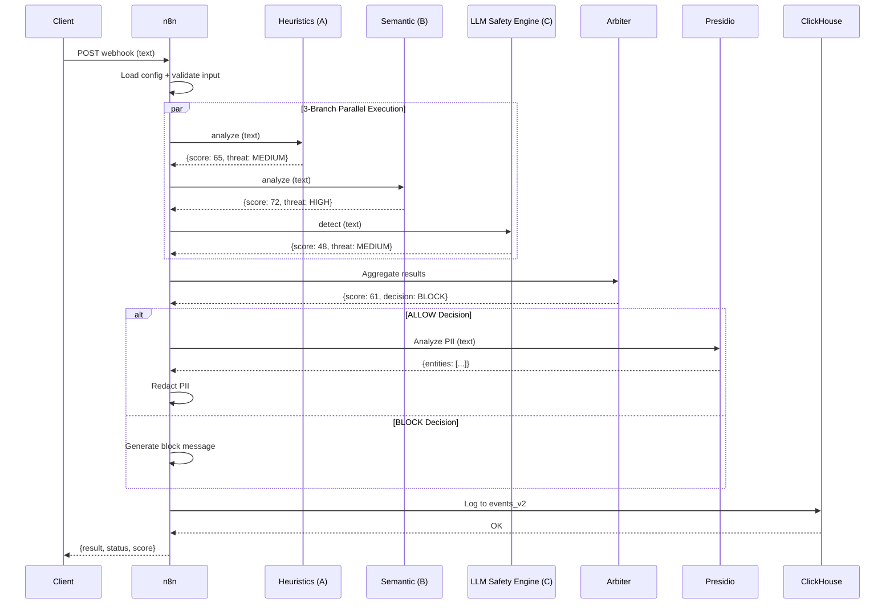
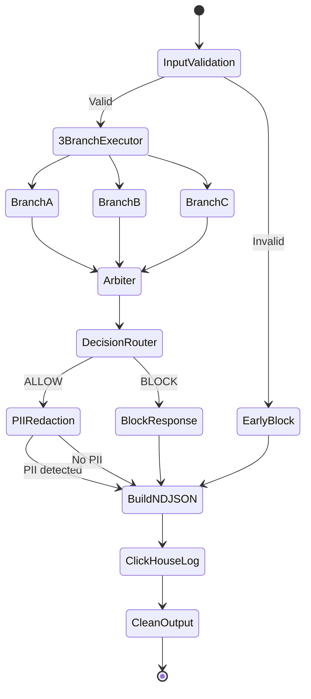

# Vigil Guard v2.0.0 - Technical Architecture

**Last updated:** 2025-11-27
**Pipeline Version:** v2.0.0
**Workflow Nodes:** 24 (11 Code nodes)

This document provides a comprehensive technical overview of Vigil Guard's v2.0.0 architecture, featuring the new 3-branch parallel detection system with Arbiter-based weighted aggregation.

---

## 📋 Table of Contents

- [Overview](#overview)
- [Architecture Evolution](#architecture-evolution)
- [Pipeline Flow](#pipeline-flow)
- [3-Branch Detection System](#3-branch-detection-system)
  - [Branch A: Heuristics Service](#branch-a-heuristics-service)
  - [Branch B: Semantic Service](#branch-b-semantic-service)
- [Branch C: LLM Safety Engine Analysis](#branch-c-llm-safety-engine-analysis)
- [Arbiter Engine](#arbiter-engine)
- [PII Redaction (Post-Detection)](#pii-redaction-post-detection)
- [Data Flow & Schema](#data-flow--schema)
- [Service Topology](#service-topology)
- [Configuration](#configuration)
- [Performance Characteristics](#performance-characteristics)
- [Security Model](#security-model)

---

## Overview

Vigil Guard v2.0.0 introduces a **3-branch parallel detection architecture** that replaces the previous sequential 40-node pipeline. The new system achieves:

- **Parallel Processing**: All 3 branches execute simultaneously using Promise.all()
- **Binary Decisions**: ALLOW or BLOCK (sanitization reserved for PII only)
- **Weighted Aggregation**: Configurable branch weights with priority boost policies
- **Fail-Secure Design**: All branches degraded → automatic BLOCK
- **Reduced Latency**: <5s total processing (vs. 30s+ in v1.x)
- **Improved Accuracy**: Semantic + ML analysis complements heuristic detection

**Key Architectural Shift:**

```
v1.x: Input → 40 Sequential Nodes → Score → Decision → Output
v2.0: Input → 3 Parallel Branches → Arbiter → Decision → PII (if ALLOW) → Output
```

---

## Architecture Evolution

### v1.x (40-Node Sequential Pipeline)
- **Nodes:** 40 total (16 Code nodes)
- **Flow:** PII → Normalize → Bloom → Allowlist → Pattern Matching → Decision → Sanitization
- **Decisions:** ALLOW (0-29), SANITIZE_LIGHT (30-64), SANITIZE_HEAVY (65-84), BLOCK (85-100)
- **Latency:** 15-30s typical (sequential processing)

### v2.0.0 (3-Branch Parallel + Arbiter)
- **Nodes:** 24 total (11 Code nodes)
- **Flow:** Input Validation → 3-Branch Executor → Arbiter → Decision Router → PII Redaction (ALLOW only)
- **Decisions:** ALLOW or BLOCK (binary)
- **Latency:** 1-5s typical (parallel execution with timeouts)
- **PII:** Applied **after** detection, only for ALLOW decisions

---

## Pipeline Flow

### High-Level Flow Diagram

```
┌─────────────────────────────────────────────────────────────────────────┐
│                        Vigil Guard v2.0.0 Pipeline                      │
└─────────────────────────────────────────────────────────────────────────┘

  [Webhook v2] / [Chat Trigger]
         │
         ▼
  ┌──────────────────┐
  │ Extract Input    │  ← Wrap chat_payload
  └────────┬─────────┘
           │
           ▼
  ┌──────────────────┐
  │ Load Config      │  ← allowlist.schema.json, pii.conf, unified_config.json
  │ (3 parallel)     │
  └────────┬─────────┘
           │
           ▼
  ┌──────────────────┐
  │ Config Loader v2 │  ← Parse & validate configuration
  └────────┬─────────┘
           │
           ▼
  ┌──────────────────┐
  │ Input Validator  │  ← Schema validation, early rejection
  └────────┬─────────┘
           │
           ├─[Invalid]──→ ┌──────────────────┐
           │              │ Early Block v2   │ → Output
           │              └──────────────────┘
           │
           ▼[Valid]
  ┌───────────────────────────────────────────────────────────────────────┐
  │                    3-Branch Executor (PARALLEL)                       │
  │                                                                        │
  │  ┌─────────────────┐  ┌─────────────────┐  ┌─────────────────┐      │
  │  │   Branch A      │  │   Branch B      │  │   Branch C      │      │
  │  │   Heuristics    │  │   Semantic      │  │   LLM Safety Engine    │      │
  │  │   :5005         │  │   :5006         │  │   :8000         │      │
  │  │   timeout: 1s   │  │   timeout: 2s   │  │   timeout: 3s   │      │
  │  └────────┬────────┘  └────────┬────────┘  └────────┬────────┘      │
  │           │                    │                    │                │
  │           └────────────────────┴────────────────────┘                │
  │                               │                                      │
  └───────────────────────────────┼──────────────────────────────────────┘
                                  │
                                  ▼
                         ┌─────────────────┐
                         │   Arbiter v2    │  ← Weighted aggregation + boosts
                         │   Weights:      │
                         │   A: 30%        │
                         │   B: 35%        │
                         │   C: 35%        │
                         └────────┬────────┘
                                  │
                                  ▼
                         ┌─────────────────┐
                         │ Arbiter Decision│  ← Binary: ALLOW or BLOCK?
                         └────────┬────────┘
                                  │
                ┌─────────────────┴─────────────────┐
                │                                   │
           [ALLOW]                              [BLOCK]
                │                                   │
                ▼                                   ▼
      ┌───────────────────┐              ┌──────────────────┐
      │ PII_Redactor_v2   │              │ Block Response   │
      │ (Presidio pl/en)  │              │ v2               │
      └─────────┬─────────┘              └────────┬─────────┘
                │                                  │
                └──────────┬───────────────────────┘
                           │
                           ▼
                  ┌──────────────────┐
                  │  Build NDJSON v2 │  ← Prepare events_v2 schema
                  └────────┬─────────┘
                           │
                           ▼
                  ┌──────────────────┐
                  │ Log to ClickHouse│  ← events_v2 table
                  └────────┬─────────┘
                           │
                           ▼
                  ┌──────────────────┐
                  │ Clean Output v2  │  ← Return to client
                  └──────────────────┘
```

### Node-by-Node Responsibilities

| Node | Type | Responsibility |
|------|------|----------------|
| `Webhook v2` | webhook | HTTP webhook trigger for API consumers |
| `When chat message received` | chatTrigger | Chat interface trigger |
| `Extract Input` | set | Wrap `chat_payload` object |
| `Load allowlist.schema.json` | readWriteFile | Load allowlist configuration |
| `Load pii.conf` | readWriteFile | Load PII detection rules |
| `Load unified_config.json` | readWriteFile | Load main configuration |
| `Extract allowlist` | extractFromFile | Parse allowlist JSON |
| `Extract pii.conf` | extractFromFile | Parse PII configuration |
| `Extract unified_config` | extractFromFile | Parse unified config JSON |
| `Merge Config` | merge | Combine all configuration streams |
| `Config Loader v2` | code | Validate and prepare config for execution |
| `Input Validator v2` | code | Schema validation, malformed input detection |
| `Validation Check` | if | Route based on validation result |
| `3-Branch Executor` | code | **Execute all 3 branches in parallel** |
| `Arbiter v2` | code | **Weighted aggregation + priority boosts** |
| `Arbiter Decision` | if | Binary decision: ALLOW or BLOCK? |
| `PII_Redactor_v2` | code | Dual-language PII detection (Polish + English) |
| `Block Response v2` | code | Generate block message |
| `Early Block v2` | code | Early rejection for invalid input |
| `Merge Final` | merge | Combine ALLOW and BLOCK paths |
| `Build NDJSON v2` | code | Prepare events_v2 schema for logging |
| `Log to ClickHouse v2` | httpRequest | Insert to events_v2 table |
| `Clean Output v2` | set | Return minimal payload to client |
| `output to plugin` | code | Format response for browser extension |

---

## 3-Branch Detection System

### Overview

The **3-Branch Executor** sends the **original text** (not normalized) to all 3 services simultaneously using `axios` and `Promise.all()`. Each branch has independent timeouts and graceful degradation.

**Unified Contract (v2.1):**

All branches return:

```typescript
{
  branch_id: 'A' | 'B' | 'C',
  name: string,
  score: number,              // 0-100
  threat_level: 'LOW' | 'MEDIUM' | 'HIGH',
  confidence: number,         // 0.0-1.0
  critical_signals: {         // Boolean flags for boosts
    [key: string]: boolean
  },
  features: object,           // Branch-specific metadata
  explanations: string[],
  timing_ms: number,
  degraded: boolean
}
```

---

### Branch A: Heuristics Service

**Endpoint:** `http://heuristics-service:5005/analyze`
**Timeout:** 1000ms
**Weight:** 30% (default)

**Detection Capabilities:**

1. **Obfuscation Detection** (weight: 0.25)
   - Zero-width characters (U+200B, U+200C, U+FEFF, etc.)
   - Homoglyph substitution (Cyrillic/Greek lookalikes)
   - Excessive unicode escapes
   - Mixed scripts (Latin + Cyrillic/Arabic/Hebrew)

2. **Structure Analysis** (weight: 0.20)
   - Unusual punctuation density
   - Repeated special characters
   - Bracket imbalance
   - Excessive whitespace

3. **Whisper Keywords** (weight: 0.25)
   - Instruction override phrases ("ignore previous", "disregard above")
   - Role manipulation ("you are now", "act as")
   - Jailbreak patterns

4. **Entropy Analysis** (weight: 0.15)
   - Shannon entropy (thresholds: low 2.0, high 4.8)
   - Language-aware bigram analysis (anomaly threshold: 0.25)
   - Relative KL divergence (threshold: 0.4)
   - Character class diversity (threshold: 4 classes)

5. **Security Keyword Detection** (weight: 0.15)
   - SQL injection patterns (`UNION SELECT`, `OR 1=1`)
   - XSS vectors (`<script>`, `onerror=`)
   - Command injection (`; cat /etc/passwd`, `| nc`)
   - Privilege escalation attempts

**Thresholds:**

- **LOW:** score ≤ 30
- **MEDIUM:** 30 < score ≤ 65
- **HIGH:** score > 65

**Critical Signals:**

- `obfuscation_detected`: Triggers `HEURISTICS_CRITICAL` boost if score ≥ 75

**Output Example:**

```json
{
  "branch_id": "A",
  "name": "heuristics",
  "score": 78,
  "threat_level": "HIGH",
  "confidence": 0.82,
  "critical_signals": {
    "obfuscation_detected": true
  },
  "features": {
    "obfuscation_score": 85,
    "structure_score": 42,
    "whisper_score": 90,
    "entropy_score": 65,
    "security_score": 70,
    "entropy_details": {
      "shannon": 4.2,
      "bigram_anomaly": 0.31,
      "relative_entropy": 0.52,
      "char_class_diversity": 5
    }
  },
  "explanations": ["High obfuscation detected", "Whisper keywords found"],
  "timing_ms": 320,
  "degraded": false
}
```

---

### Branch B: Semantic Service

**Endpoint:** `http://semantic-service:5006/analyze`
**Timeout:** 2000ms
**Weight:** 35% (default)

**Detection Method:**

- **Embedding Similarity:** Compares input text embeddings to known attack vectors
- **Vector Database:** Pre-indexed malicious prompt patterns
- **Cosine Similarity:** Threshold-based matching

**Critical Signals:**

- `high_similarity`: Triggers `SEMANTIC_HIGH_SIMILARITY` boost (min score: 70)

**Output Example:**

```json
{
  "branch_id": "B",
  "name": "semantic",
  "score": 72,
  "threat_level": "HIGH",
  "confidence": 0.88,
  "critical_signals": {
    "high_similarity": true
  },
  "features": {
    "max_similarity": 0.91,
    "matched_categories": ["prompt_injection", "role_manipulation"],
    "top_matches": 5
  },
  "explanations": ["High similarity to known prompt injection attacks"],
  "timing_ms": 1580,
  "degraded": false
}
```

---

### Branch C: LLM Safety Engine Analysis

**Endpoint:** `http://prompt-guard-api:8000/detect`
**Timeout:** 3000ms
**Weight:** 35% (default)

**Detection Method:**

- **Model:** Llama Guard 2 (86M parameters)
- **Classification:** Binary attack detection with confidence scoring

**Response Normalization:**

The 3-Branch Executor normalizes the LLM Guard response to the unified contract:

```javascript
if (is_attack === true) {
  score = 85;  // HIGH threat
} else {
  score = Math.round((risk_score || 0.01) * 100);
}

threat_level = is_attack ? 'HIGH' : (score >= 40 ? 'MEDIUM' : 'LOW');
```

**Critical Signals:**

- `llm_attack`: Set to `true` when `is_attack === true`
  - Triggers `LLM_GUARD_HIGH_CONFIDENCE` boost if confidence > 0.9
  - Triggers `CONSERVATIVE_OVERRIDE` boost if weighted score < 50

**Output Example:**

```json
{
  "branch_id": "C",
  "name": "llm_guard",
  "score": 85,
  "threat_level": "HIGH",
  "confidence": 0.93,
  "critical_signals": {
    "llm_attack": true
  },
  "features": {
    "is_attack": true,
    "risk_score": 0.85,
    "verdict": "Attack detected"
  },
  "explanations": ["Attack detected"],
  "timing_ms": 2340,
  "degraded": false
}
```

---

### Graceful Degradation

When a branch fails (timeout, service unavailable, error), a **degraded result** is returned:

```json
{
  "branch_id": "A",
  "name": "heuristics",
  "score": 0,
  "threat_level": "LOW",
  "confidence": 0,
  "critical_signals": {},
  "features": {
    "degraded_reason": "Service unavailable"
  },
  "explanations": ["heuristics degraded: Service unavailable"],
  "timing_ms": 1020,
  "degraded": true
}
```

**Weight Adjustment:**

Degraded branches have their weights multiplied by `degradation.weight_multiplier` (default: 0.1), then all weights are normalized to sum to 1.0.

**Fail-Secure Policy:**

If **all 3 branches are degraded**, the Arbiter returns:

```json
{
  "combined_score": 100,
  "final_decision": "BLOCK",
  "all_degraded": true,
  "explanations": ["All branches degraded - fail-secure BLOCK"]
}
```

---

## Arbiter Engine

### Overview

The **Arbiter v2** aggregates results from all 3 branches using **weighted voting** and applies **priority boost policies** to handle edge cases where weighted scores may be misleading.

### Default Configuration

```json
{
  "arbiter_config": {
    "weights": {
      "heuristics": 0.30,
      "semantic": 0.35,
      "llm_guard": 0.35
    },
    "thresholds": {
      "block_min": 50
    },
    "boosts": {
      "llm_high_confidence_enabled": true,
      "llm_high_confidence_threshold": 0.9,
      "llm_high_confidence_min_score": 85,

      "semantic_high_similarity_enabled": true,
      "semantic_high_similarity_min_score": 70,

      "heuristics_critical_enabled": true,
      "heuristics_critical_score_threshold": 75,
      "heuristics_critical_min_score": 70,

      "unanimous_high_enabled": true,
      "unanimous_high_min_score": 90,

      "conservative_override_enabled": true,
      "conservative_override_confidence": 0.95,
      "conservative_override_score": 50,
      "conservative_override_min_score": 65
    },
    "degradation": {
      "weight_multiplier": 0.1,
      "all_degraded_action": "BLOCK"
    }
  }
}
```

### Weighted Score Calculation

**Step 1: Adjust weights for degraded branches**

```javascript
const weights = { A: 0.30, B: 0.35, C: 0.35 };

if (branchA.degraded) weights.A *= 0.1;  // 0.03
if (branchB.degraded) weights.B *= 0.1;  // 0.035
// weights.C unchanged (0.35)

// Normalize to sum to 1.0
const totalWeight = 0.03 + 0.035 + 0.35 = 0.415;
weights.A = 0.03 / 0.415 = 0.072;
weights.B = 0.035 / 0.415 = 0.084;
weights.C = 0.35 / 0.415 = 0.844;
```

**Step 2: Calculate weighted score**

```javascript
combinedScore = (branchA.score * weights.A) +
                (branchB.score * weights.B) +
                (branchC.score * weights.C);
```

**Example:**

- Branch A: score=65, degraded=false, weight=0.30
- Branch B: score=42, degraded=false, weight=0.35
- Branch C: score=78, degraded=false, weight=0.35

```
combinedScore = (65 * 0.30) + (42 * 0.35) + (78 * 0.35)
              = 19.5 + 14.7 + 27.3
              = 61.5
```

### Priority Boost Policies

Boosts are applied **after** weighted score calculation to handle cases where the weighted score underestimates threat severity.

**Boost Execution Order:**

1. **CONSERVATIVE_OVERRIDE**
2. **SEMANTIC_HIGH_SIMILARITY**
3. **HEURISTICS_CRITICAL**
4. **LLM_GUARD_HIGH_CONFIDENCE**
5. **UNANIMOUS_HIGH**

---

#### 1. CONSERVATIVE_OVERRIDE

**Trigger Conditions:**

- `branchC.critical_signals.llm_attack === true`
- `branchC.confidence > 0.95`
- `combinedScore < 50`

**Action:**

```javascript
combinedScore = Math.max(combinedScore, 65);
```

**Rationale:**

If the LLM Safety Engine detects an attack with very high confidence, but the weighted score is low (possibly due to low heuristic/semantic scores), boost to at least 65 to ensure BLOCK decision.

**Example:**

- Branch A: score=20 (benign-looking structure)
- Branch B: score=18 (no semantic match)
- Branch C: score=85, confidence=0.97, llm_attack=true

Weighted: `(20*0.3) + (18*0.35) + (85*0.35) = 42.05`
**Boost applied:** 42.05 → 65

---

#### 2. SEMANTIC_HIGH_SIMILARITY

**Trigger Conditions:**

- `branchB.threat_level === 'HIGH'`
- `branchB.critical_signals.high_similarity === true`

**Action:**

```javascript
combinedScore = Math.max(combinedScore, 70);
```

**Rationale:**

High embedding similarity to known attacks indicates a strong match to the attack database.

---

#### 3. HEURISTICS_CRITICAL

**Trigger Conditions:**

- `branchA.score >= 75`
- `branchA.critical_signals.obfuscation_detected === true`

**Action:**

```javascript
combinedScore = Math.max(combinedScore, 70);
```

**Rationale:**

Heavy obfuscation with high heuristic score is a strong indicator of evasion techniques.

---

#### 4. LLM_GUARD_HIGH_CONFIDENCE

**Trigger Conditions:**

- `branchC.threat_level === 'HIGH'`
- `branchC.critical_signals.llm_attack === true`
- `branchC.confidence > 0.9`

**Action:**

```javascript
combinedScore = Math.max(combinedScore, 85);
```

**Rationale:**

Very high confidence attack detection from the LLM Safety Engine.

---

#### 5. UNANIMOUS_HIGH

**Trigger Conditions:**

- `branchA.threat_level === 'HIGH'`
- `branchB.threat_level === 'HIGH'`
- `branchC.threat_level === 'HIGH'`

**Action:**

```javascript
combinedScore = Math.max(combinedScore, 90);
```

**Rationale:**

All 3 independent branches agree on HIGH threat → very strong consensus.

---

### Final Decision

```javascript
const finalScore = Math.round(combinedScore);
const finalDecision = finalScore >= 50 ? 'BLOCK' : 'ALLOW';
```

**Binary Decisions:**

- `finalScore >= 50` → **BLOCK**
- `finalScore < 50` → **ALLOW**

---

### Arbiter Output Example

```json
{
  "arbiter_result": {
    "combined_score": 73,
    "final_decision": "BLOCK",
    "confidence": 0.817,
    "all_degraded": false,
    "branches": {
      "A": {
        "score": 65,
        "threat_level": "MEDIUM",
        "weight": 0.300,
        "degraded": false,
        "critical_signals": {}
      },
      "B": {
        "score": 72,
        "threat_level": "HIGH",
        "weight": 0.350,
        "degraded": false,
        "critical_signals": { "high_similarity": true }
      },
      "C": {
        "score": 85,
        "threat_level": "HIGH",
        "weight": 0.350,
        "degraded": false,
        "critical_signals": { "llm_attack": true }
      }
    },
    "boosts_applied": ["SEMANTIC_HIGH_SIMILARITY"],
    "explanations": [
      "High obfuscation detected",
      "High similarity to known prompt injection attacks",
      "Attack detected"
    ]
  },
  "_isBlocked": true
}
```

---

## PII Redaction (Post-Detection)

**Critical Change in v2.0.0:**

PII redaction is applied **ONLY for ALLOW decisions**, **AFTER** the Arbiter decision.

**Flow:**

1. Arbiter returns `final_decision: "ALLOW"`
2. `Arbiter Decision` routes to `PII_Redactor_v2`
3. Dual-language Presidio analysis (Polish + English in parallel)
4. Entity deduplication and redaction
5. Output flagged with `_pii_sanitized: true`

**Services Used:**

- **Presidio PII API** (`:5001`) - Polish entities
- **Presidio PII API** (`:5001`) - English entities
- **Language Detector** (`:5002`) - Hybrid detection

**Supported Entities:**

- `EMAIL_ADDRESS`, `PHONE_NUMBER`, `PERSON`
- `PL_PESEL`, `PL_NIP`, `PL_REGON`, `PL_ID_CARD`
- `CREDIT_CARD`, `IBAN_CODE`
- `IP_ADDRESS`, `URL`, `DATE_TIME`, `LOCATION`
- 50+ total entity types

**Redaction Tokens:**

```
EMAIL: [EMAIL USUNIĘTY]
PHONE: [TELEFON USUNIĘTY]
PERSON: [NAZWISKO USUNIĘTE]
PL_PESEL: [PESEL USUNIĘTY]
CREDIT_CARD: [KARTA USUNIĘTA]
```

**Audit Flags:**

```json
{
  "_pii_sanitized": true,
  "pii_classification": {
    "types": ["EMAIL_ADDRESS", "PERSON"],
    "count": 3,
    "method": "presidio",
    "detected_language": "pl"
  }
}
```

**Final Status Values:**

- `ALLOWED` - No PII detected, arbiter decision = ALLOW
- `SANITIZED` - PII detected and redacted, arbiter decision = ALLOW
- `BLOCKED` - Arbiter decision = BLOCK

---

## Data Flow & Schema

### ClickHouse Schema (events_v2)

The `Build NDJSON v2` node prepares data for the `events_v2` table:

```sql
CREATE TABLE events_v2 (
  -- Identifiers
  sessionId String,
  action String,
  timestamp DateTime64(3),

  -- Text data
  original_input String,
  chat_input String,
  result String,
  detected_language String,

  -- Scores
  threat_score UInt8,
  branch_a_score UInt8,
  branch_b_score UInt8,
  branch_c_score UInt8,

  -- Decision
  final_status Enum8('ALLOWED' = 1, 'SANITIZED' = 2, 'BLOCKED' = 3),
  final_decision Enum8('ALLOW' = 1, 'BLOCK' = 2, 'UNKNOWN' = 3),
  boosts_applied Array(String),
  confidence Float32,

  -- PII
  pii_sanitized UInt8,
  pii_types_detected Array(String),
  pii_entities_count UInt16,

  -- Client metadata
  client_id String,
  browser_name String,
  browser_version String,
  os_name String,

  -- Pipeline metadata
  pipeline_version String,
  config_version String,

  -- JSON fields for detailed analysis
  arbiter_json String,
  branch_results_json String,
  pii_classification_json String
) ENGINE = MergeTree()
ORDER BY (timestamp, sessionId)
PARTITION BY toYYYYMM(timestamp)
TTL timestamp + INTERVAL 90 DAY;
```

**Key Columns:**

- `threat_score`: Arbiter's combined score (0-100)
- `branch_a_score`, `branch_b_score`, `branch_c_score`: Individual branch scores
- `final_status`: ALLOWED, SANITIZED, or BLOCKED
- `boosts_applied`: Array of boost policy names
- `pii_sanitized`: 0 (no PII) or 1 (PII redacted)
- `arbiter_json`: Full Arbiter result for investigation

---

## Service Topology

### Docker Network Architecture

```
┌────────────────────────────────────────────────────────────────┐
│                      vigil-network (bridge)                    │
├────────────────────────────────────────────────────────────────┤
│                                                                │
│  ┌──────────────┐      ┌──────────────┐      ┌─────────────┐ │
│  │   Caddy      │      │   n8n        │      │ ClickHouse  │ │
│  │   :80        │      │   :5678      │      │ :8123, :9000│ │
│  └──────┬───────┘      └──────┬───────┘      └──────┬──────┘ │
│         │                     │                     │         │
│  ┌──────▼───────┐      ┌──────▼───────┐      ┌─────▼──────┐ │
│  │ Web UI       │      │ Heuristics   │      │  Grafana   │ │
│  │ Frontend     │      │ Service      │      │  :3001     │ │
│  │ :5173→:80    │      │ :5005        │      └────────────┘ │
│  └──────────────┘      └──────────────┘                      │
│                                                                │
│  ┌──────────────┐      ┌──────────────┐      ┌─────────────┐ │
│  │ Web UI       │      │ Semantic     │      │ Prompt Guard│ │
│  │ Backend      │      │ Service      │      │ API         │ │
│  │ :8787        │      │ :5006        │      │ :8000       │ │
│  └──────────────┘      └──────────────┘      └─────────────┘ │
│                                                                │
│  ┌──────────────┐      ┌──────────────┐                       │
│  │ Presidio PII │      │ Language     │                       │
│  │ :5001        │      │ Detector     │                       │
│  └──────────────┘      │ :5002        │                       │
│                        └──────────────┘                       │
└────────────────────────────────────────────────────────────────┘
```

### Service Ports

| Service | Internal Port | External Port | Purpose |
|---------|---------------|---------------|---------|
| **Caddy** | 80 | 80 | Reverse proxy (main entry point) |
| **n8n** | 5678 | 5678 | Workflow engine |
| **ClickHouse HTTP** | 8123 | 8123 | Analytics database |
| **ClickHouse Native** | 9000 | - | Native protocol (internal only) |
| **Grafana** | 3000 | 3001 | Monitoring dashboards |
| **Web UI Frontend** | 80 | 5173 | React SPA (dev mode) |
| **Web UI Backend** | 8787 | 8787 | Express API |
| **Heuristics Service** | 5005 | 5005 | Branch A detection |
| **Semantic Service** | 5006 | 5006 | Branch B detection |
| **Prompt Guard API** | 8000 | 8000 | Branch C detection |
| **Presidio PII** | 5001 | 5001 | PII detection |
| **Language Detector** | 5002 | 5002 | Language identification |

### Service Dependencies

```
n8n
├── Heuristics Service (:5005)
├── Semantic Service (:5006)
├── Prompt Guard API (:8000)
├── Presidio PII (:5001)
├── Language Detector (:5002)
└── ClickHouse (:8123)

Web UI Backend
├── ClickHouse (:8123)
└── Presidio PII (:5001)

Grafana
└── ClickHouse (:8123)
```

---

## Configuration

### unified_config.json

**Location:** `services/workflow/config/unified_config.json`

**Key Sections:**

```json
{
  "version": "2.0.0",
  "arbiter_config": {
    "weights": {
      "heuristics": 0.30,
      "semantic": 0.35,
      "llm_guard": 0.35
    },
    "thresholds": {
      "block_min": 50
    },
    "boosts": { ... },
    "degradation": {
      "weight_multiplier": 0.1,
      "all_degraded_action": "BLOCK"
    }
  },
  "endpoints": {
    "heuristics": "http://heuristics-service:5005/analyze",
    "semantic": "http://semantic-service:5006/analyze",
    "llm_guard": "http://prompt-guard-api:8000/detect",
    "presidio_pii": "http://presidio-pii-api:5001/analyze",
    "language_detector": "http://language-detector:5002/detect"
  },
  "timeouts": {
    "branch_a": 1000,
    "branch_b": 2000,
    "branch_c": 3000
  }
}
```

### pii.conf

**Location:** `services/workflow/config/pii.conf`

Contains:
- Regex patterns for PII fallback detection (13 patterns)
- Entity type enable/disable flags
- Redaction token templates

### allowlist.schema.json

**Location:** `services/workflow/config/allowlist.schema.json`

JSON Schema for allowlisted input patterns (early ALLOW bypass).

---

## Performance Characteristics

### Latency Targets

| Component | Target | Typical |
|-----------|--------|---------|
| **3-Branch Executor** (parallel) | <3s | 1-2s |
| **Branch A (Heuristics)** | <1s | 300-500ms |
| **Branch B (Semantic)** | <2s | 1-1.5s |
| **Branch C (LLM Safety Engine)** | <3s | 2-2.5s |
| **Arbiter** | <100ms | 20-50ms |
| **PII Redaction** | <500ms | 200-350ms |
| **Total Pipeline** | <5s | 2-4s |

### Throughput

- **Sequential Processing:** 1 request/workflow instance
- **Horizontal Scaling:** Deploy multiple n8n workers
- **Branch Services:** Independently scalable

### Resource Usage

| Service | CPU | Memory |
|---------|-----|--------|
| **n8n** | 0.5-1.0 core | 512MB-1GB |
| **Heuristics Service** | 0.2-0.5 core | 256MB |
| **Semantic Service** | 1-2 cores | 2-4GB (embedding models) |
| **Prompt Guard API** | 2-4 cores | 4-8GB (Llama Guard 2) |
| **ClickHouse** | 1-2 cores | 2-4GB |
| **Total** | 5-10 cores | 10-20GB |

---

## Security Model

### Threat Detection Layers

1. **Input Validation** (Early Block)
   - Schema validation
   - Malformed JSON rejection
   - Length limits

2. **3-Branch Detection** (Parallel)
   - Heuristics: Obfuscation, structure, entropy
   - Semantic: Embedding similarity
   - LLM Safety Engine: ML-based classification

3. **Arbiter Aggregation** (Weighted + Boosts)
   - Fail-secure degradation
   - Priority boost policies

4. **PII Redaction** (ALLOW only)
   - Dual-language detection
   - 50+ entity types

### Fail-Secure Principles

- **All branches degraded** → BLOCK
- **Service unavailable** → Degraded result (low weight)
- **Timeout exceeded** → Degraded result
- **Configuration error** → Block by default

### Authentication & Authorization

- **Web UI:** JWT tokens (24h expiration)
- **n8n Webhooks:** Optional API key authentication
- **ClickHouse:** Password-protected (auto-generated)
- **Grafana:** Admin password (auto-generated)

---

## Mermaid Diagrams

### Sequence Diagram: Typical Request



### State Diagram: Decision Flow



---

## References

- **n8n Documentation:** https://docs.n8n.io/
- **Microsoft Presidio:** https://microsoft.github.io/presidio/
- **ClickHouse:** https://clickhouse.com/docs/
- **Llama Guard 2:** https://huggingface.co/meta-llama/Llama-Guard-2-8B
- **OWASP LLM Top 10:** https://owasp.org/www-project-top-10-for-large-language-model-applications/

---

**Document Version:** 2.0.0
**Last Reviewed:** 2025-11-27
**Maintainer:** Vigil Guard Team
