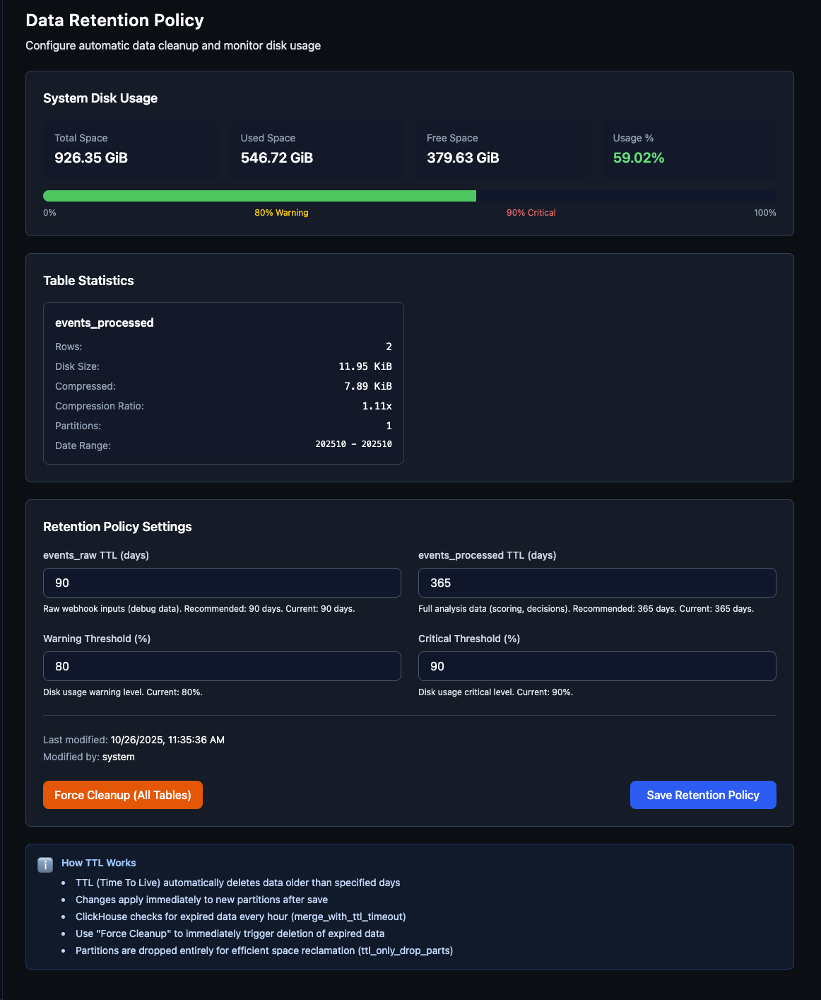

# ClickHouse Data Retention Policy

## Overview

Vigil Guard implements automatic data retention and cleanup for ClickHouse event logs to prevent unbounded disk usage growth. The system uses ClickHouse TTL (Time To Live) functionality combined with a GUI-based configuration interface.

## Architecture

### Components

1. **ClickHouse TTL** - Automatic data deletion at table level
2. **Retention Config Table** - Single-row configuration table storing policy settings
3. **Backend API** - Express.js endpoints for retention management (`/api/retention/*`)
4. **Frontend GUI** - React component for policy configuration (`/config/retention`)
5. **Grafana Dashboard** - Disk usage monitoring and visualization

### Data Flow

```
User Changes TTL → Frontend → Backend API → ClickHouse
                                            ↓
                                    ALTER TABLE MODIFY TTL
                                            ↓
                            Background merge process (hourly)
                                            ↓
                                    Expired data deleted
```

## Retention Tiers

### Default Configuration

| Table | TTL (days) | Purpose | Est. Size @ 5K prompts/day |
|-------|------------|---------|---------------------------|
| `events_raw` | 90 | Debug data, raw webhook inputs | 0.9-1.8 GB |
| `events_processed` | 365 | Full analysis data (scoring, decisions) | 9-18 GB |

**Total estimated size: 10-20 GB/year** (study: `clickhouse_retention_study.md`)

### Table Schema

Both tables include TTL configuration:

```sql
-- events_raw
TTL toDateTime(timestamp) + INTERVAL 90 DAY DELETE

-- events_processed
TTL toDateTime(timestamp) + INTERVAL 365 DAY DELETE
```

### Retention Config Table

```sql
CREATE TABLE n8n_logs.retention_config
(
  id                              UInt8 DEFAULT 1,
  events_raw_ttl_days             UInt16 DEFAULT 90,
  events_processed_ttl_days       UInt16 DEFAULT 365,
  merge_with_ttl_timeout_seconds  UInt32 DEFAULT 3600,  -- Check every 1 hour
  ttl_only_drop_parts             UInt8  DEFAULT 1,      -- Drop whole partitions
  warn_disk_usage_percent         UInt8  DEFAULT 80,
  critical_disk_usage_percent     UInt8  DEFAULT 90,
  last_modified_at                DateTime DEFAULT now(),
  last_modified_by                String   DEFAULT 'system',
  CONSTRAINT single_row CHECK id = 1
)
ENGINE = MergeTree
ORDER BY id;
```

## Configuration Interface

### Web UI

**Location**: Configuration → System → Data Retention
**URL**: `http://localhost/ui/config/retention`
**Permissions**: Requires `can_view_configuration` permission

### Features

1. **System Disk Usage Overview**
   - Total/Used/Free space display
   - Color-coded usage percentage (green/yellow/red)
   - Progress bar with warning/critical thresholds

2. **Table Statistics**
   - Per-table metrics (rows, disk size, compressed size)
   - Compression ratio
   - Partition count and date ranges

3. **Retention Policy Settings**
   - Editable TTL days (1-3650 range)
   - Warning threshold (default: 80%)
   - Critical threshold (default: 90%)
   - Audit trail (last modified by/at)

4. **Force Cleanup**
   - Manual trigger for `OPTIMIZE TABLE FINAL`
   - Immediately deletes expired data
   - Available per-table or all tables

**Visual Interface:**



The Data Retention configuration screen provides real-time disk usage monitoring, TTL policy management, and force cleanup controls for both events_raw and events_processed tables.

### API Endpoints

```
GET    /api/retention/config          - Get current retention config
PUT    /api/retention/config          - Update retention config
GET    /api/retention/disk-usage      - Get disk usage statistics
POST   /api/retention/cleanup         - Force immediate cleanup
GET    /api/retention/partitions/:table - Get partition information
```

## TTL Behavior

### How TTL Works

1. **Evaluation**: ClickHouse checks for expired data every `merge_with_ttl_timeout_seconds` (default: 1 hour)
2. **Deletion**: Only during merge operations (background process)
3. **Partition-Level**: With `ttl_only_drop_parts = 1`, entire partitions are dropped (more efficient)
4. **Immediate Cleanup**: Use `OPTIMIZE TABLE FINAL` to force merge and deletion

### TTL Expression

```sql
TTL toDateTime(timestamp) + INTERVAL {ttl_days} DAY DELETE
```

- `toDateTime()` - Converts DateTime64 to DateTime (required for TTL)
- `INTERVAL {ttl_days} DAY` - Retention period
- `DELETE` - Action to perform (delete expired rows)

### Partition Strategy

**events_raw**: `PARTITION BY partition_date` (daily partitions)
**events_processed**: `PARTITION BY toYYYYMM(timestamp)` (monthly partitions)

Partitions older than TTL threshold are dropped entirely for efficient space reclamation.

## Monitoring

### Grafana Dashboard

**Dashboard**: ClickHouse Disk Usage & Retention
**UID**: `clickhouse-disk-usage-001`
**Location**: `services/monitoring/grafana/provisioning/dashboards/disk-usage-dashboard.json`

**Panels**:
1. System Disk Usage (gauge) - Current disk usage percentage
2. Table Disk Usage Over Time - Time series of events_raw vs events_processed
3. TTL Configuration Display - Current retention days (stat panels)
4. Active Partitions Count - Number of partitions per table
5. Compression Ratio - Efficiency of data compression
6. Table Statistics Summary - Comprehensive table metrics

### Metrics Queries

```sql
-- System Disk Usage
SELECT round((sum(total_space) - sum(free_space)) / sum(total_space) * 100, 2) AS disk_usage_percent
FROM system.disks WHERE name = 'default'

-- Table Size
SELECT sum(bytes_on_disk) AS size, table
FROM system.parts
WHERE database = 'n8n_logs' AND table IN ('events_raw', 'events_processed') AND active = 1
GROUP BY table

-- Partition Count
SELECT uniq(partition) AS partition_count, table
FROM system.parts
WHERE database = 'n8n_logs' AND active = 1
GROUP BY table
```

## Operations

### Changing Retention Policy

1. **Via Web UI** (Recommended):
   - Navigate to Configuration → Data Retention
   - Adjust TTL days for each table
   - Set warning/critical thresholds
   - Click "Save Retention Policy"
   - Changes apply immediately to new partitions

2. **Via API** (Programmatic):
   ```bash
   curl -X PUT http://localhost/ui/api/retention/config \
     -H "Authorization: Bearer $TOKEN" \
     -H "Content-Type: application/json" \
     -d '{
       "events_raw_ttl_days": 90,
       "events_processed_ttl_days": 365
     }'
   ```

### Force Cleanup

When you need to immediately reclaim disk space:

1. **Via Web UI**:
   - Go to Data Retention page
   - Click "Force Cleanup (All Tables)"
   - Confirm action
   - Wait for OPTIMIZE TABLE operations to complete

2. **Via API**:
   ```bash
   curl -X POST http://localhost/ui/api/retention/cleanup \
     -H "Authorization: Bearer $TOKEN" \
     -H "Content-Type: application/json" \
     -d '{"table": "all"}'
   ```

3. **Via ClickHouse CLI**:
   ```sql
   OPTIMIZE TABLE n8n_logs.events_raw FINAL;
   OPTIMIZE TABLE n8n_logs.events_processed FINAL;
   ```

### Verification

Check active TTL settings:

```sql
-- Show table DDL with TTL
SHOW CREATE TABLE n8n_logs.events_raw;
SHOW CREATE TABLE n8n_logs.events_processed;

-- Check current config
SELECT * FROM n8n_logs.retention_config WHERE id = 1;

-- View partition info
SELECT partition, sum(rows) AS rows, formatReadableSize(sum(bytes_on_disk)) AS size
FROM system.parts
WHERE database = 'n8n_logs' AND table = 'events_processed' AND active = 1
GROUP BY partition
ORDER BY partition DESC
LIMIT 20;
```

## Troubleshooting

### Issue: Disk usage not decreasing after TTL change

**Cause**: TTL only deletes data during merge operations (background process)

**Solution**:
```sql
-- Force merge and TTL cleanup
OPTIMIZE TABLE n8n_logs.events_raw FINAL;
OPTIMIZE TABLE n8n_logs.events_processed FINAL;
```

### Issue: TTL not applying to existing data

**Cause**: TTL changes only affect future merges, not retroactively

**Solution**: Force cleanup (see above) or wait for next automatic merge

### Issue: Partitions not being dropped

**Check**: Verify `ttl_only_drop_parts` setting:
```sql
SELECT name, value FROM system.settings WHERE name = 'ttl_only_drop_parts';
```

**Verify partition age**:
```sql
SELECT partition, min(min_time) AS oldest_data, max(max_time) AS newest_data
FROM system.parts
WHERE database = 'n8n_logs' AND table = 'events_processed' AND active = 1
GROUP BY partition
ORDER BY partition;
```

### Issue: "Failed to update retention config"

**Possible causes**:
1. Invalid TTL days (must be 1-3650)
2. Warning threshold >= critical threshold
3. Missing `can_view_configuration` permission
4. ClickHouse connection issues

**Check backend logs**:
```bash
docker logs vigil-web-ui-backend | grep retention
```

## Best Practices

### 1. Set Appropriate Retention Periods

- **events_raw (90 days)**: Debug data, raw inputs - shorter retention acceptable
- **events_processed (365 days)**: Analysis data - longer retention for compliance/forensics

### 2. Monitor Disk Usage Regularly

- Set warning threshold at 80% (proactive alerting)
- Set critical threshold at 90% (urgent action required)
- Review Grafana dashboard weekly

### 3. Plan for Growth

Use the retention calculator:

```
Daily prompts: 5,000
events_raw (90 days):   5000 * 90 * 2.5 KB = 1.1 GB
events_processed (365): 5000 * 365 * 5 KB = 9.1 GB
Total: ~10 GB/year
```

Scale retention based on available disk space.

### 4. Test Retention Changes in Non-Production

Before applying to production:
1. Test TTL changes in staging environment
2. Verify data deletion behavior
3. Confirm no impact on reporting/dashboards

### 5. Backup Before Major Changes

Before modifying retention policy:
```bash
# Backup ClickHouse data
docker exec vigil-clickhouse clickhouse-client --query \
  "SELECT * FROM n8n_logs.events_processed FORMAT Native" \
  > events_processed_backup.native
```

## Security Considerations

### Permissions

- Retention configuration requires `can_view_configuration` permission
- Only users with this permission can modify TTL settings
- All changes are audited in `retention_config.last_modified_by`

### Audit Trail

Every retention policy change is logged:
- Username of person who made the change
- Timestamp of modification
- Can be queried via API or directly from database

### Data Deletion

- TTL deletion is **irreversible**
- Data cannot be recovered once deleted by TTL
- Ensure adequate retention period before reducing TTL

## Installation

Retention policy is automatically configured during installation:

```bash
./install.sh
```

**What happens during installation**:
1. ClickHouse container started
2. Database `n8n_logs` created
3. Tables `events_raw` and `events_processed` created with TTL
4. `retention_config` table initialized with defaults (90/365 days)
5. Grafana dashboard provisioned

**No manual configuration required** - system is ready to use after installation.

## References

- **ClickHouse TTL Documentation**: https://clickhouse.com/docs/en/engines/table-engines/mergetree-family/mergetree#table_engine-mergetree-ttl
- **Retention Study**: `clickhouse_retention_study.md` (original analysis)
- **Implementation Plan**: `backup/IMPLEMENTATION_PLAN.md`
- **Backend Module**: `services/web-ui/backend/src/retention.ts`
- **Frontend Component**: `services/web-ui/frontend/src/components/RetentionPolicy.tsx`
- **Grafana Dashboard**: `services/monitoring/grafana/provisioning/dashboards/disk-usage-dashboard.json`

## FAQ

**Q: Can I disable TTL entirely?**
A: Set TTL days to 3650 (10 years) - effectively disables automatic deletion.

**Q: How often does ClickHouse check for expired data?**
A: Every `merge_with_ttl_timeout_seconds` (default: 1 hour).

**Q: Does force cleanup impact performance?**
A: Yes, `OPTIMIZE TABLE FINAL` is resource-intensive. Run during low-traffic periods.

**Q: Can I set different TTL for different threat categories?**
A: No, TTL is table-level only. All rows in a table share the same TTL policy.

**Q: What happens if I run out of disk space?**
A: ClickHouse may fail to write new data. Monitor disk usage and reduce TTL or add storage capacity proactively.

**Q: Can I recover deleted data?**
A: No, TTL deletion is permanent. Implement regular backups if data recovery is required.
