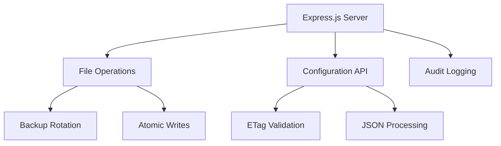
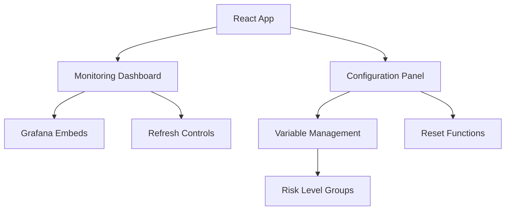

# Vigil Guard - Local Configuration Panel

[](https://opensource.org/licenses/MIT)
[](https://nodejs.org/)
[](https://reactjs.org/)
[](https://www.typescriptlang.org/)

> **Enterprise-grade prompt injection detection and defense platform with real-time monitoring and configuration management.**

## 🛡️ Overview

Vigil Guard is a comprehensive security platform designed to protect Large Language Model (LLM) applications from prompt injection attacks and malicious content. The Local Configuration Panel provides a user-friendly interface for configuring security policies, monitoring real-time threats, and analyzing security metrics.

### Key Features

- 🔍 **Real-time Prompt Injection Detection** - Advanced pattern matching and ML-based threat detection
- 📊 **Comprehensive Monitoring Dashboard** - Grafana-integrated analytics with 6 specialized panels
- ⚙️ **Flexible Configuration Management** - Dynamic security policy configuration with backup rotation
- 🔄 **Auto-refresh Capabilities** - Live data updates with configurable refresh intervals
- 🎯 **Risk-based Categorization** - CRITICAL, HIGH, MEDIUM, LOW threat levels
- 📈 **Performance Analytics** - Block rates, maliciousness trends, and detection categories
- 🔒 **Enterprise Security** - ETag-based optimistic locking and atomic file operations

## 📚 Documentation

Complete documentation for Vigil Guard:

### Getting Started
| Document | Description |
|----------|-------------|
| **[Quick Start Guide](QUICKSTART.md)** ⚡ | Get running in 5 minutes |
| **[Installation Guide](INSTALLATION.md)** | Setup and deployment instructions |
| **[User Guide](USER_GUIDE.md)** | Complete UI walkthrough (monitoring, analyzer, file manager) |
| **[Troubleshooting Guide](TROUBLESHOOTING.md)** | Common issues and solutions |

### Configuration & Operations
| Document | Description |
|----------|-------------|
| **[Configuration Reference](CONFIGURATION.md)** | Security policy configuration details |
| **[Config Variables](CONFIG_VARIABLES.md)** | Variable reference |
| **[Detection Categories](DETECTION_CATEGORIES.md)** | Attack detection patterns and scoring reference |
| **[Docker Guide](DOCKER.md)** | Container architecture and management |
| **[Maintenance Guide](MAINTENANCE.md)** | Updates, backups, and security scanning |

### Security & Authentication
| Document | Description |
|----------|-------------|
| **[Security Guide](SECURITY.md)** | Security policies and best practices |
| **[Authentication](AUTHENTICATION.md)** | User management and RBAC |
| **[CI/CD Secrets](CI_SECRETS.md)** | GitHub Actions configuration |

### Integration & APIs
| Document | Description |
|----------|-------------|
| **[API Documentation](API.md)** | REST API reference |
| **[Grafana Setup](GRAFANA_SETUP.md)** | Dashboard configuration |
| **[ClickHouse Retention](CLICKHOUSE_RETENTION.md)** | Data lifecycle management |
| **[PII Detection](PII_DETECTION.md)** | Dual-language PII detection system |

## 📁 Project Structure

```
vigil-guard/
├── services/                   # All microservices
│   ├── workflow/              # n8n workflow engine
│   ├── web-ui/               # Configuration interface
│   ├── monitoring/           # Analytics stack
│   └── proxy/                # Caddy reverse proxy
├── prompt-guard-api/         # Llama Prompt Guard service
├── docs/                      # Documentation (you are here)
├── scripts/                   # Automation scripts
├── docker-compose.yml         # Main orchestration
└── README.md                 # Project overview
```

## 🚀 Quick Start

### Prerequisites

- **Node.js** ≥ 18.0.0
- **npm** ≥ 8.0.0
- **Docker** (for Grafana)
- **Git** (for version control)

### Installation

1. **Clone the repository**
   ```bash
   git clone <repository-url>
   cd vigil-guard
   ```

2. **Install dependencies**
   ```bash
   # Backend
   cd services/web-ui/backend
   npm install

   # Frontend
   cd ../frontend
   npm install
   ```

3. **Start the services**
   ```bash
   # Terminal 1: Backend
   cd services/web-ui/backend
   npm run start

   # Terminal 2: Frontend
   cd services/web-ui/frontend
   npm run dev
   ```

4. **Access the application**
   - Frontend: http://localhost/ui (via Caddy) or :5173 (dev)
   - Backend API: http://localhost:8787

For detailed setup instructions, see [INSTALLATION.md](./INSTALLATION.md).

## 📊 Monitoring Dashboard

The monitoring dashboard provides real-time analytics through 6 specialized Grafana panels:

| Panel | Description | Purpose |
|-------|-------------|---------|
| **Input/Output Table** | Real-time processing data | Monitor current system activity |
| **TOP-10 Detection Categories** | Dominant threat analysis | Identify prevalent attack types |
| **Volume + Status Distribution** | ALLOWED/SANITIZED/BLOCKED stats | Track decision patterns |
| **Block Rate Percentage** | Percentage of blocked requests | Early warning indicator |
| **Maliciousness Trend** | AVG & P95 score analysis | Risk trend monitoring |
| **Histogram Time Series** | Score distribution buckets | Pattern visualization |

### Dashboard Controls

- **Time Range**: 1h, 6h, 12h, 24h, 7d
- **Auto Refresh**: 10s, 30s, 1m, 5m, or manual
- **Manual Refresh**: Force immediate update

## ⚙️ Configuration Management

### Security Variables

The system manages 27 active security variables across different categories:

#### Risk Level Configuration
- **CRITICAL**: Immediate blocking threshold
- **HIGH**: High-risk detection threshold
- **MEDIUM**: Medium-risk monitoring threshold
- **LOW**: Low-risk baseline threshold

#### System Settings
- **ENABLE_SANITIZATION**: Content sanitization toggle
- **MAX_RETRIES**: Maximum retry attempts
- **LOG_LEVEL**: Logging verbosity (DEBUG, INFO, WARN, ERROR)

For complete configuration reference, see [CONFIGURATION.md](./CONFIGURATION.md).

### Backup Management

The system automatically maintains configuration backups:
- **Maximum 2 backups** per configuration file
- **Automatic rotation** - oldest backup deleted when limit exceeded
- **Full audit log** maintained indefinitely
- **Atomic operations** prevent corruption

## 🔧 API Endpoints

### Configuration API

| Method | Endpoint | Description |
|--------|----------|-------------|
| `GET` | `/api/config` | Retrieve all configuration variables |
| `POST` | `/api/config` | Update configuration with ETag validation |
| `GET` | `/api/audit` | Retrieve audit log entries |

### Request/Response Examples

**Get Configuration:**
```bash
curl http://localhost:8787/api/config
```

**Update Configuration:**
```bash
curl -X POST http://localhost:8787/api/config \
  -H "Content-Type: application/json" \
  -H "If-Match: \"etag-value\"" \
  -d '{"CRITICAL_THRESHOLD": 0.85}'
```

## 🏗️ Architecture

### Backend Architecture



### Frontend Architecture



## 🐳 Docker Support

### Backend Dockerfile
```dockerfile
FROM node:18-alpine
WORKDIR /app
COPY package*.json ./
RUN npm ci --only=production
COPY dist/ ./dist/
EXPOSE 8787
CMD ["node", "dist/server.js"]
```

### Frontend Dockerfile
```dockerfile
FROM node:18-alpine as build
WORKDIR /app
COPY package*.json ./
RUN npm ci
COPY . .
RUN npm run build

FROM nginx:alpine
COPY --from=build /app/dist /usr/share/nginx/html
EXPOSE 80
```

## 📈 Grafana Integration

The system integrates with Grafana for advanced analytics. Key requirements:

- **Grafana Version**: ≥ 9.0.0
- **Port Configuration**: 3001 (default)
- **Authentication**: Admin user with dashboard access
- **Iframe Embedding**: Enabled in security settings

For complete Grafana setup instructions, see [GRAFANA_SETUP.md](./GRAFANA_SETUP.md).

## 🔒 Security Features

### Access Control
- **ETag-based Concurrency Control** - Prevents configuration conflicts
- **Atomic File Operations** - Ensures data consistency
- **Backup Rotation** - Protects against data loss

### Content Security Policy
```html
<meta http-equiv="Content-Security-Policy"
      content="default-src 'self';
               img-src 'self' data: blob:;
               style-src 'self' 'unsafe-inline';
               script-src 'self';
               frame-src http://localhost:3001;" />
```

### CORS Configuration
```javascript
app.use(cors({
  origin: 'http://localhost:5173',
  credentials: true,
  optionsSuccessStatus: 200
}));
```

## 🚨 Troubleshooting

### Common Issues

#### Frontend Not Loading
```bash
# Clear cache and restart
cd frontend
npm run no-cache
```

#### Grafana Connection Issues
```bash
# Check Grafana status
curl -I http://localhost:3001/api/health

# Restart Grafana container
docker restart grafana-container
```

#### Backend Port Conflicts
```bash
# Check port usage
lsof -i :8787

# Kill conflicting process
kill -9 <PID>
```

### Log Locations

- **Backend Logs**: Console output from Express server
- **Frontend Logs**: Browser developer console
- **Audit Logs**: `backend/audit.log`
- **Configuration Backups**: `backend/*.json__*` files

## 🤝 Contributing

1. Fork the repository
2. Create a feature branch (`git checkout -b feature/amazing-feature`)
3. Commit your changes (`git commit -m 'Add amazing feature'`)
4. Push to the branch (`git push origin feature/amazing-feature`)
5. Open a Pull Request

### Development Guidelines

- Follow TypeScript strict mode
- Use ESLint and Prettier for code formatting
- Write comprehensive tests for new features
- Update documentation for API changes

## 📄 License

This project is licensed under the MIT License - see the [LICENSE](LICENSE) file for details.

## 📞 Support

- **Documentation**: [doc/](./doc/)
- **Issues**: [GitHub Issues](https://github.com/tbartel74/Vigil-Guard/issues)
- **Security**: security@your-organization.com

---

<div align="center">

**[Installation Guide](./INSTALLATION.md)** • **[User Guide](./USER_GUIDE.md)** • **[Configuration Reference](./CONFIGURATION.md)** • **[Detection Categories](./DETECTION_CATEGORIES.md)** • **[API Docs](./API.md)**

Made with ❤️ for LLM Security

</div>