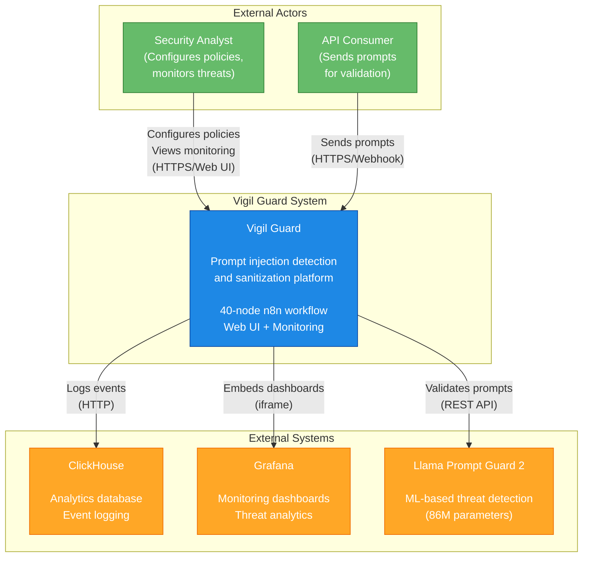
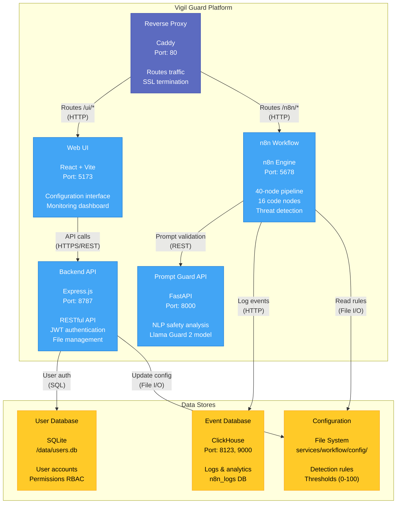

# Technical Architecture

**Last updated:** 2025-10-17

This document explains the pipeline, node responsibilities, decision logic, data shapes, and includes C4 architecture diagrams, Mermaid diagrams and I/O examples based on the current workflow (nodes=40, code nodes=16).

---

## 📋 Table of Contents

- [🏗️ C4 Architecture Diagrams](#️-c4-architecture-diagrams)
  - [Context Diagram (Level 1)](#context-diagram-level-1)
  - [Container Diagram (Level 2)](#container-diagram-level-2)
  - [Deployment Diagram](#deployment-diagram)
- [🔄 Pipeline Overview](#-pipeline-overview)
- [📦 Nodes & Responsibilities](#-nodes--responsibilities)
- [🎯 Decision Logic & Thresholds](#-decision-logic--thresholds)
- [📊 Sample I/O](#-sample-io)
- [📈 Mermaid Diagrams](#-mermaid-diagrams)
- [📉 Metrics](#-metrics)
- [🔒 Security](#-security)
- [📚 References](#-references)

---

## 🏗️ C4 Architecture Diagrams

The C4 model provides hierarchical views of Vigil Guard's architecture, from high-level context down to deployment details.

### Context Diagram (Level 1)

Shows Vigil Guard in the context of users and external systems.



### Container Diagram (Level 2)

Shows the main containers (applications/services) that make up Vigil Guard.



### Deployment Diagram

Shows how containers are deployed in the Docker environment.

```mermaid
graph TB
    subgraph "Docker Host (vigil-network)"
        subgraph "Caddy Container"
            C[Caddy :80]
        end

        subgraph "Web UI Containers"
            F[Frontend<br/>nginx :80<br/>(internal)]
            B[Backend<br/>Express :8787]
        end

        subgraph "Processing"
            N[n8n :5678]
            PG[Prompt Guard<br/>FastAPI :8000]
        end

        subgraph "Data Layer"
            CH[ClickHouse<br/>:8123 (HTTP)<br/>:9000 (TCP)]
            G[Grafana :3000]
        end

        subgraph "Volumes"
            V1[vigil_data/<br/>web-ui/users.db<br/>config files]
            V2[clickhouse-data/]
            V3[grafana-data/]
            V4[../vigil-llm-models/<br/>Llama-Prompt-Guard-2-86M/]
        end
    end

    Client[Client Browser] -->|":80"| C
    C -->|"/ui/* → :80<br/>(strip prefix)"| F
    C -->|"/ui/api/* → :8787<br/>(strip prefix)"| B
    C -->|"/n8n/* → :5678"| N
    C -->|"/grafana/* → :3000"| G

    B -.->|"mount"| V1
    N -.->|"mount"| V1
    CH -.->|"mount"| V2
    G -.->|"mount"| V3
    PG -.->|"mount (ro)"| V4

    N -->|"HTTP"| CH
    N -->|"HTTP"| PG
    B -->|"SQL"| V1

    style C fill:#5c6bc0,stroke:#3949ab,color:#fff
    style F fill:#42a5f5,stroke:#1976d2,color:#fff
    style B fill:#42a5f5,stroke:#1976d2,color:#fff
    style N fill:#42a5f5,stroke:#1976d2,color:#fff
    style PG fill:#42a5f5,stroke:#1976d2,color:#fff
    style CH fill:#ef5350,stroke:#c62828,color:#fff
    style G fill:#ef5350,stroke:#c62828,color:#fff
    style V1 fill:#ffca28,stroke:#f9a825,color:#000
    style V2 fill:#ffca28,stroke:#f9a825,color:#000
    style V3 fill:#ffca28,stroke:#f9a825,color:#000
    style V4 fill:#ffca28,stroke:#f9a825,color:#000
    style Client fill:#66bb6a,stroke:#2e7d32,color:#fff
```

**Key Deployment Details:**

- **Network**: All services communicate via `vigil-network` Docker network
- **Reverse Proxy**: Caddy on port 80 is the main entry point
  - Strips `/ui` prefix before proxying to nginx
  - Frontend built with `base: "/ui/"` in Vite config
- **Data Persistence**:
  - User DB & config files: `vigil_data/` volume
  - ClickHouse: `clickhouse-data/` volume
  - Grafana: `grafana-data/` volume
  - LLM model: External directory (license restrictions)
- **Security**: All service passwords auto-generated during installation (cryptographically secure)

---

## 🔄 Pipeline Overview

1. **When chat message received** → **Keep only set** (wraps `chat_payload`)
2. **Loading/Extract config** → `allowlist.schema.json`, `normalize.conf`, `unified_config.json`, `rules.config.json`, `thresholds.config.json`
3. **PII_Redactor** → **Normalize_Node** → **Bloom_Prefilter** → **Allowlist_Validator** → **Pattern_Matching_Engine**
4. **Unified Decision Engine** → **Correlation_Engine** → **Sanitization_Enforcement**
5. Guard branch: **Prepare Groq Request** → **Prompt Guard API** → **LLM Context Restore** → **Finale Decision**
6. **Build+Sanitize NDJSON** → **Logging to ClickHouse** → **Clean output**

---

## 📦 Nodes & Responsibilities

| Node | Type | Key Role |
|------|------|----------|
| `When chat message received` | @n8n/n8n-nodes-langchain.chatTrigger | Trigger (chat) |
| `Keep only set` | n8n-nodes-base.set | Create `chat_payload` |
| `Loading config files *.json` | n8n-nodes-base.readWriteFile | Read config files |
| `Loading config files *.conf` | n8n-nodes-base.readWriteFile | Read config files |
| `Loading config files *.conf1` | n8n-nodes-base.readWriteFile | Read config files |
| `Loading config files *.conf2` | n8n-nodes-base.readWriteFile | Read config files |
| `Loading config files *.conf3` | n8n-nodes-base.readWriteFile | Read config files |
| `Loading config files *.conf4` | n8n-nodes-base.readWriteFile | Read config files |
| `Extract from File` | n8n-nodes-base.extractFromFile | Parse config JSON/text |
| `Extract from File1` | n8n-nodes-base.extractFromFile | Parse config JSON/text |
| `Merge` | n8n-nodes-base.merge | Merge data streams |
| `Config Loader` | n8n-nodes-base.code | Load & validate config |
| `PII_Redactor` | n8n-nodes-base.code | PII/secret redaction |
| `Normalize_Node` | n8n-nodes-base.code | Canonicalization & obfuscation signals |
| `Bloom_Prefilter` | n8n-nodes-base.code | Heuristic prefilter/bloom |
| `Allowlist_Validator` | n8n-nodes-base.code | JSON Schema allowlist |
| `Pattern_Matching_Engine` | n8n-nodes-base.code | Regex matching & scoring |
| `Unified Decision Engine` | n8n-nodes-base.code | Score → decision mapping |
| `Correlation_Engine` | n8n-nodes-base.code | Escalation via signals |
| `Sanitization_Enforcement` | n8n-nodes-base.code | Apply LIGHT/HEAVY; enforce limits |
| `If` | n8n-nodes-base.if | Conditional branch |
| `Prepare Groq Request` | n8n-nodes-base.code | Build LLM guard payload |
| `Prompt Guard API` | n8n-nodes-base.httpRequest | External guard call |
| `LLM Context Restore` | n8n-nodes-base.code | Parse guard result |
| `Merge1` | n8n-nodes-base.merge | Merge guard path |
| `Merge2` | n8n-nodes-base.merge | Merge to finalize |
| `Finale Decision` | n8n-nodes-base.code | Final routing & messages |
| `Build+Sanitize NDJSON` | n8n-nodes-base.code | NDJSON emission |
| `Logging to ClickHouse` | n8n-nodes-base.httpRequest | ClickHouse logging |
| `Clean output` | n8n-nodes-base.set | Minimal downstream payload |
| `Correlation_Engine` | n8n-nodes-base.code | Signal correlation & escalation |
| *(Additional nodes)* | *(Various types)* | *(Config loading, merging, etc.)* |

> **Note:** Names match the workflow exactly (n=40; Code nodes=16). The table above shows key nodes; full workflow includes additional nodes for config loading, merging, and control flow.

---

## 🎯 Decision Logic & Thresholds

### Deterministic sanitizer ranges (`thresholds.config.json`)

| Decision | Min | Max |
|----------|-----|-----|
| `allow` | 0 | 29 |
| `sanitize_light` | 30 | 64 |
| `sanitize_heavy` | 65 | 84 |
| `block` | 85 | 100 |

Final routing considers: the sanitizer decision, correlation escalations, HEAVY removal %, and the Prompt Guard score.

---

## 📊 Sample I/O

### Normalize_Node (abridged, redacted)

**Input:**
\```json
{
  "chat_payload": {
    "sessionId": "...",
    "action": "sendMessage",
    "chatInput": "ig\u200Bnore pr\u0131or instr."
  }
}
\```

**Output:**
\```json
{
  "normalization": {
    "canonical": "ignore prior instr.",
    "obfuscationSignals": ["zero-width", "mixed-latin-cyrillic"]
  }
}
\```

### Finale Decision (abridged)

\```json
{
  "routing": {
    "shouldBlock": false,
    "shouldWarn": true,
    "isSafe": false
  },
  "metrics": {
    "injectionScore": 0.52,
    "scorePercent": 52,
    "severity": 3
  },
  "output_text": "<sanitized or block message>"
}
\```

---

## 📈 Mermaid Diagrams

### Flowchart — Main Data Path

\```mermaid
flowchart TD
  N1["Merge1"]
  N2["Config Loader"]
  N3["Extract from File"]
  N4["Build+Sanitize NDJSON"]
  N5["Extract from File1"]
  N6["PII_Redactor"]
  N7["Loading config files *.conf1"]
  N8["Loading config files *.conf2"]
  N9["Loading config files *.conf"]
  N10["Normalize_Node"]
  N11["Loading config files *.conf3"]
  N12["Pattern_Matching_Engine"]
  N13["Loading config files *.json"]
  N14["LLM Context Restore"]
  N15["Loading config files *.conf4"]
  N16["Merge2"]
  N17["Logging to ClickHouse"]
  N18["Sanitization_Enforcement"]
  N19["Prompt Guard API"]
  N20["Merge"]
  N21["Clean output"]
  N22["Allowlist_Validator"]
  N23["Keep only set"]
  N24["Unified Decision Engine"]
  N25["Finale Decision"]
  N26["Bloom_Prefilter"]
  N27["If"]
  N28["Prepare Groq Request"]
  N29["When chat message received"]
  
  N4 --> N17
  N17 --> N21
  N2 --> N6
  N20 --> N2
  N23 --> N20
  N23 --> N13
  N23 --> N9
  N23 --> N7
  N23 --> N8
  N23 --> N15
  N13 --> N3
  N9 --> N3
  N7 --> N5
  N8 --> N5
  N15 --> N5
  N3 --> N20
  N5 --> N20
  N20 --> N2
  N6 --> N10
  N10 --> N26
  N26 --> N22
  N22 --> N12
  N12 --> N24
  N24 --> N18
  N18 --> N27
  N27 --> N28
  N28 --> N19
  N19 --> N16
  N16 --> N14
  N14 --> N25
  N18 --> N25
  N25 --> N4
  N4 --> N17
\```

### Sequence — Example Interaction

\```mermaid
sequenceDiagram
  participant User
  participant n8n as n8n Workflow
  participant Guard as Prompt-Guard API
  
  User->>n8n: chatInput
  n8n->>n8n: Set/Load/Merge configs
  n8n->>n8n: PII Redact → Normalize → Prefilter → Validate → Pattern Score
  n8n->>n8n: Unified Decision → Correlation → Sanitization
  
  alt needs LLM guard
    n8n->>Guard: sanitized text (short)
    Guard-->>n8n: score (0–1)
  end
  
  n8n->>n8n: Final Decision → Build NDJSON → (optional) ClickHouse
  n8n-->>User: output_text
\```

> **Note:** Diagrams are GFM-compatible; if they don't render in your view, verify GitHub's Mermaid support/version.

---

## 📉 Metrics

| Metric | Description |
|--------|-------------|
| `injectionScore` / `scorePercent` | LLM guard score [0–1]/[0–100] |
| `severity` | Mapped to a 1..5 scale |
| `removal_pct` | Percentage of characters removed by sanitization; may enforce BLOCK in HEAVY |
| `config_hash` | Hash of (config, rules, thresholds) for auditability |

---

## 🔒 Security

- **Keep allowlist schema strict and versioned**: validate early
- **Treat the LLM guard as advisory** unless policy is block; log confidence
- **Secure logging endpoints with HTTPS**: use a write-only service user

---

## 📚 References

- [Code](https://docs.n8n.io/integrations/builtin/core-nodes/n8n-nodes-base.code/)
- [Merge](https://docs.n8n.io/integrations/builtin/core-nodes/n8n-nodes-base.merge/)
- [Edit Fields (Set)](https://docs.n8n.io/integrations/builtin/core-nodes/n8n-nodes-base.set/)
- [HTTP Request](https://docs.n8n.io/integrations/builtin/core-nodes/n8n-nodes-base.httprequest/)
- [Extract from File](https://docs.n8n.io/integrations/builtin/core-nodes/n8n-nodes-base.extractFromFile/)
- [GFM](https://github.github.com/gfm/)
- [Mermaid (GitHub)](https://docs.github.com/en/get-started/writing-on-github/working-with-advanced-formatting/creating-diagrams)
- [Mermaid Flowchart](https://docs.mermaidchart.com/mermaid-oss/syntax/flowchart.html)
- [Mermaid Sequence](https://mermaid.js.org/syntax/sequenceDiagram.html)
- [OWASP LLM Top 10](https://owasp.org/www-project-top-10-for-large-language-model-applications/)
- [OWASP Input Validation](https://cheatsheetseries.owasp.org/cheatsheets/Input_Validation_Cheat_Sheet.html)
