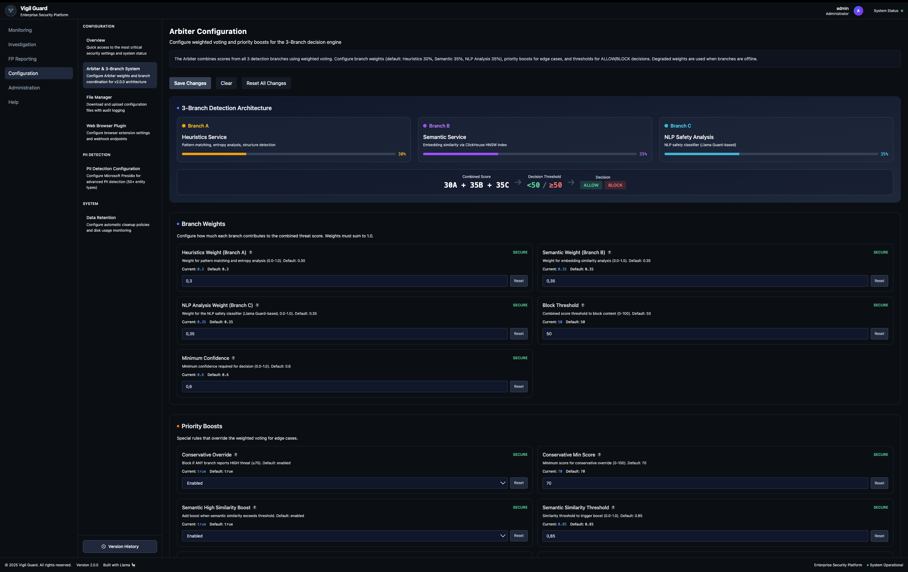

# Web UI (frontend + backend)

Last updated: 2025-11-26

## Role
Configuration console and system status view. Backend exposes configuration APIs, service health checks, and ClickHouse integration.

## Ports and routing
- Frontend: dev 5173, prod via Caddy under `/ui/`.
- Backend: 8787 (via Caddy `/ui/api/*`).

## Key backend endpoints
- `/api/system/containers` – health for Heuristics, Semantic, NLP Safety, Language Detector, ClickHouse, PII.
- `/api/config` – get/update configuration (ETag).
- `/api/audit` – configuration audit log.

## Dependencies
- ClickHouse (events/FP reports).
- Branch services: `HEURISTICS_SERVICE_URL`, `SEMANTIC_SERVICE_URL`, `PROMPT_GUARD_URL`, `LANGUAGE_DETECTOR_URL`.

## Arbiter settings in UI
- 3-branch weights, BLOCK threshold, boosts (LLM_GUARD_VETO, etc.), degraded handling.
- Branch C labeled “NLP Safety Analysis”.

## Plugin
- Workflow node `output to plugin` returns allow/block/sanitize; backend does not alter this contract, but surfaces health/config data.

## Monitoring and Investigation
- Monitoring dashboard (Grafana) with status/score distribution:  
  
- Investigation panel with list and detail views:  
    
  
- Data retention configuration:  
  
